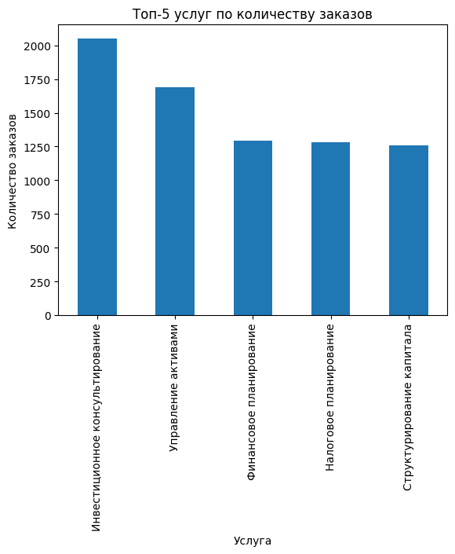
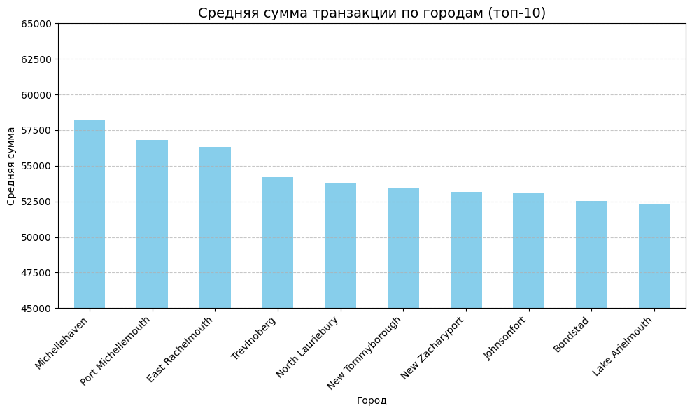
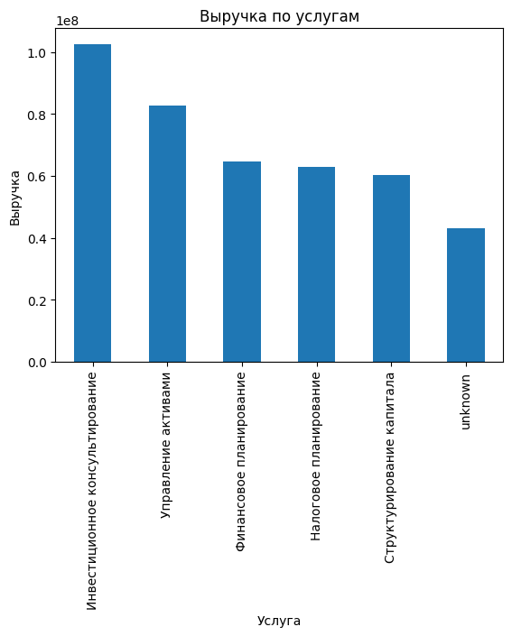
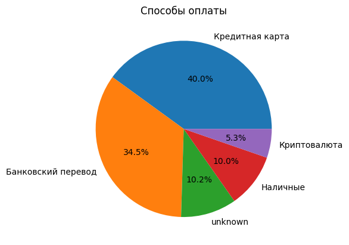
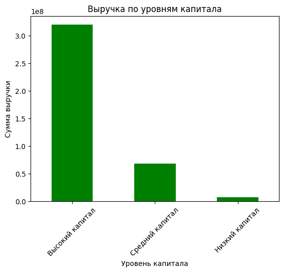
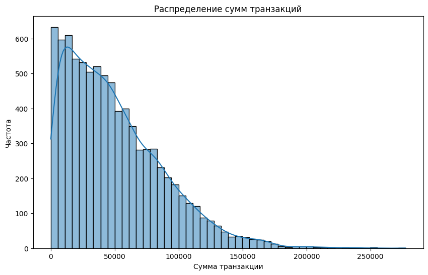
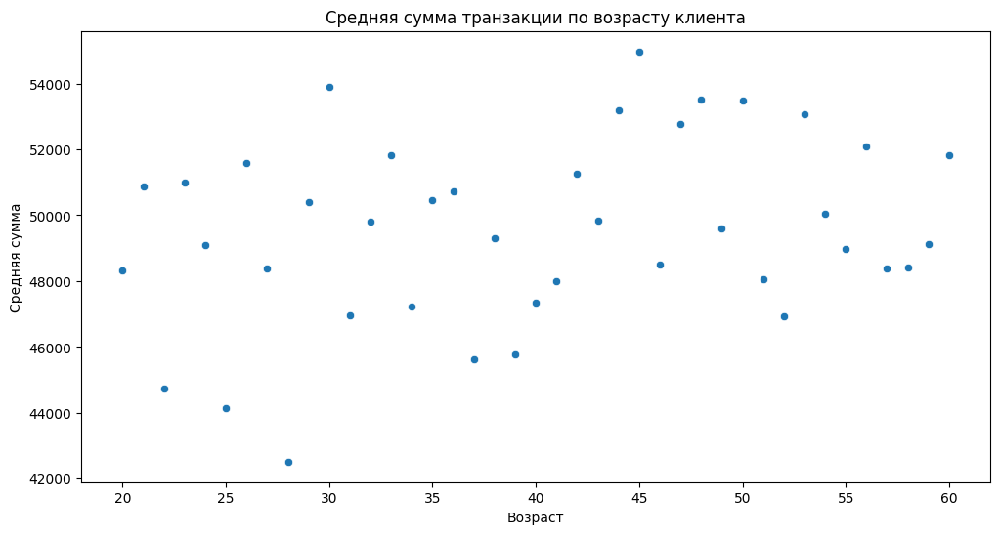
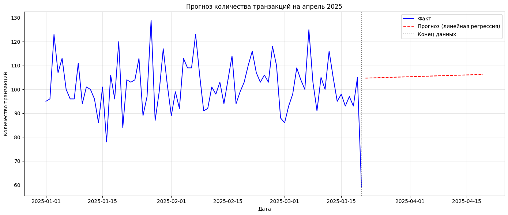

```python
import pandas as pd
import numpy as np

# Загружаем данные
df = pd.read_excel(r'C:\Projects\LeontevaDEF\transactions_data.xlsx')

# Первые 5 строк
print("Первые строки:")
display(df.head())

# Общая информация (типы данных, память, кол-во не-null значений)
print("\nИнформация о DataFrame:")
df.info()

# Статистика по числовым колонкам
print("\nОписательная статистика:")
display(df.describe())

# Проверка количества пропусков в каждой колонке
print("\nКоличество пропусков:")
print(df.isnull().sum())

# Процент пропусков
print("\nПроцент пропусков:")
print((df.isnull().sum() / len(df)) * 100)
```

    Первые строки:
    


<div>
<style scoped>
    .dataframe tbody tr th:only-of-type {
        vertical-align: middle;
    }

    .dataframe tbody tr th {
        vertical-align: top;
    }

    .dataframe thead th {
        text-align: right;
    }
</style>
<table border="1" class="dataframe">
  <thead>
    <tr style="text-align: right;">
      <th></th>
      <th>transaction_id</th>
      <th>client_id</th>
      <th>transaction_date</th>
      <th>service</th>
      <th>amount</th>
      <th>payment_method</th>
      <th>city</th>
      <th>consultant</th>
    </tr>
  </thead>
  <tbody>
    <tr>
      <th>0</th>
      <td>ff36597c-df41-44a0-9f46-6aa1fe615270</td>
      <td>1ec5ab91-fdd0-4925-a221-f0c4e04fe0e7</td>
      <td>2025-01-04 00:02:20</td>
      <td>Структурирование капитала</td>
      <td>55838.059789</td>
      <td>Банковский перевод</td>
      <td>North Patrickport</td>
      <td>Cheryl Waller</td>
    </tr>
    <tr>
      <th>1</th>
      <td>0d5263ec-413d-44d9-a9d3-a996e3a56b05</td>
      <td>c940f45c-d29b-439a-8fa3-f75018cef528</td>
      <td>2025-03-10 17:16:50</td>
      <td>Структурирование капитала</td>
      <td>37514.809209</td>
      <td>Неизвестно</td>
      <td>New Zacharyport</td>
      <td>Frank Pollard</td>
    </tr>
    <tr>
      <th>2</th>
      <td>5e9a8978-df1c-483f-a53b-16149c93f11e</td>
      <td>cfa21d7e-8499-43d0-9dfb-f4a1b94ce44c</td>
      <td>2025-02-13 19:43:49</td>
      <td>Структурирование капитала</td>
      <td>21022.146872</td>
      <td>Неизвестно</td>
      <td>Port Michellemouth</td>
      <td>Alexandra Meyer</td>
    </tr>
    <tr>
      <th>3</th>
      <td>524031ea-56e2-410a-aee2-e8fc6ae3fbc5</td>
      <td>NaN</td>
      <td>2025-03-02 03:14:10</td>
      <td>Финансовое планирование</td>
      <td>2313.980219</td>
      <td>Неизвестно</td>
      <td>Erichaven</td>
      <td>Patricia Haas</td>
    </tr>
    <tr>
      <th>4</th>
      <td>421aaf04-c97d-42ac-b35f-09a56bbaf910</td>
      <td>3f43d7bc-37f0-4535-8391-51702d6ff81e</td>
      <td>2025-03-18 21:00:36</td>
      <td>Структурирование капитала</td>
      <td>5636.586955</td>
      <td>Неизвестно</td>
      <td>Bondstad</td>
      <td>Melissa Pena</td>
    </tr>
  </tbody>
</table>
</div>


    
    Информация о DataFrame:
    <class 'pandas.DataFrame'>
    RangeIndex: 10000 entries, 0 to 9999
    Data columns (total 8 columns):
     #   Column            Non-Null Count  Dtype  
    ---  ------            --------------  -----  
     0   transaction_id    9526 non-null   str    
     1   client_id         9798 non-null   str    
     2   transaction_date  10000 non-null  object 
     3   service           10000 non-null  str    
     4   amount            9540 non-null   float64
     5   payment_method    10000 non-null  str    
     6   city              10000 non-null  str    
     7   consultant        10000 non-null  str    
    dtypes: float64(1), object(1), str(6)
    memory usage: 625.1+ KB
    
    Описательная статистика:
    


<div>
<style scoped>
    .dataframe tbody tr th:only-of-type {
        vertical-align: middle;
    }

    .dataframe tbody tr th {
        vertical-align: top;
    }

    .dataframe thead th {
        text-align: right;
    }
</style>
<table border="1" class="dataframe">
  <thead>
    <tr style="text-align: right;">
      <th></th>
      <th>amount</th>
    </tr>
  </thead>
  <tbody>
    <tr>
      <th>count</th>
      <td>9540.000000</td>
    </tr>
    <tr>
      <th>mean</th>
      <td>49246.781517</td>
    </tr>
    <tr>
      <th>std</th>
      <td>37961.999532</td>
    </tr>
    <tr>
      <th>min</th>
      <td>14.044907</td>
    </tr>
    <tr>
      <th>25%</th>
      <td>19074.838850</td>
    </tr>
    <tr>
      <th>50%</th>
      <td>41651.706800</td>
    </tr>
    <tr>
      <th>75%</th>
      <td>71378.894526</td>
    </tr>
    <tr>
      <th>max</th>
      <td>277442.155248</td>
    </tr>
  </tbody>
</table>
</div>


    
    Количество пропусков:
    transaction_id      474
    client_id           202
    transaction_date      0
    service               0
    amount              460
    payment_method        0
    city                  0
    consultant            0
    dtype: int64
    
    Процент пропусков:
    transaction_id      4.74
    client_id           2.02
    transaction_date    0.00
    service             0.00
    amount              4.60
    payment_method      0.00
    city                0.00
    consultant          0.00
    dtype: float64
    


```python
import pandas as pd
import numpy as np

# Загружаем данные
df = pd.read_excel(r'C:\Projects\LeontevaDEF\transactions_data.xlsx')

# Список маркеров, которые нужно считать пропусками
placeholder_values = [
    'INVALID_DATE', 
    'Неизвестная услуга', 
    'Неизвестно', 
    'Неизвестный город', 
    'Неизвестный консультант'
]

# Заменяем эти значения на NaN во всём DataFrame
df.replace(placeholder_values, np.nan, inplace=True)

# Теперь можно применять стандартные методы очистки
print("Пропуски после замены маркеров:")
print(df.isnull().sum())
```

    Пропуски после замены маркеров:
    transaction_id       474
    client_id            202
    transaction_date    1005
    service              990
    amount               460
    payment_method      1008
    city                 383
    consultant           368
    dtype: int64
    


```python
df['transaction_date'] = pd.to_datetime(df['transaction_date'], errors='coerce')
# Все NaN останутся NaN, а некорректные строки уже заменены, так что errors='coerce' не понадобится, но оставим для подстраховки.
```


```python
import pandas as pd
import numpy as np

# Загрузка
df = pd.read_excel(r'C:\Projects\LeontevaDEF\transactions_data.xlsx')

# 1. Замена маркеров на NaN
placeholders = ['INVALID_DATE', 'Неизвестная услуга', 'Неизвестно', 
                'Неизвестный город', 'Неизвестный консультант']
df.replace(placeholders, np.nan, inplace=True)

# 2. Очистка дат
df['transaction_date'] = pd.to_datetime(df['transaction_date'], errors='coerce')
# Удалим строки, где дата так и осталась NaN (были INVALID_DATE или реальные пропуски)
df = df.dropna(subset=['transaction_date'])

# 3. Очистка amount (как раньше)
df['amount'] = pd.to_numeric(df['amount'], errors='coerce')  # на случай если есть текстовые ошибки
df = df.dropna(subset=['amount'])

# 4. Категориальные колонки: заполняем 'unknown' вместо NaN
categorical_cols = ['service', 'payment_method', 'city', 'consultant']
for col in categorical_cols:
    df[col] = df[col].fillna('unknown')
    
# 5. Удаление дубликатов (по желанию)
df = df.drop_duplicates()

# Проверка итога
print(df.info())
print(df['service'].value_counts())
print(df['payment_method'].value_counts())
# и т.д.
```

    <class 'pandas.DataFrame'>
    Index: 8580 entries, 0 to 9999
    Data columns (total 8 columns):
     #   Column            Non-Null Count  Dtype         
    ---  ------            --------------  -----         
     0   transaction_id    8172 non-null   str           
     1   client_id         8411 non-null   str           
     2   transaction_date  8580 non-null   datetime64[us]
     3   service           8580 non-null   str           
     4   amount            8580 non-null   float64       
     5   payment_method    8580 non-null   str           
     6   city              8580 non-null   str           
     7   consultant        8580 non-null   str           
    dtypes: datetime64[us](1), float64(1), str(6)
    memory usage: 603.3 KB
    None
    service
    Инвестиционное консультирование    2085
    Управление активами                1729
    Налоговое планирование             1316
    Финансовое планирование            1315
    Структурирование капитала          1287
    unknown                             848
    Name: count, dtype: int64
    payment_method
    Кредитная карта       3424
    Банковский перевод    2969
    unknown                883
    Наличные               847
    Криптовалюта           457
    Name: count, dtype: int64
    


```python
print(df['client_id'].isnull().sum())
```

    169
    


```python
# Удаляем строки с пропущенными client_id
print(f"До удаления: {df.shape}")
df = df.dropna(subset=['client_id'])
print(f"После удаления: {df.shape}")
print(f"Осталось пропусков в client_id: {df['client_id'].isnull().sum()}")
```

    До удаления: (8580, 8)
    После удаления: (8411, 8)
    Осталось пропусков в client_id: 0
    


```python
df.to_csv('transactions_cleaned.csv', index=False)
df.to_excel('transactions_cleaned.xlsx', index=False)
print("Очищенные данные сохранены.")
```

    Очищенные данные сохранены.
    


```python
Топ-5 услуг – лидирует «Инвестиционное консультирование» (2085 заказов).

Средняя сумма по городам – значения варьируются от ~58 000 до ~42 000, при этом город «unknown» (заполненные пропуски) имеет среднюю 48 664, что не выбивается из общего ряда.

Услуга с наибольшей выручкой – также «Инвестиционное консультирование» (104,2 млн).

Способы оплаты – основная доля приходится на кредитные карты (39,9%) и банковские переводы (34,6%).

Выручка за последний месяц – за последние 30 дней: 161,5 млн, за полный март (по 20 марта): 105,3 млн (логично, так как март неполный).
```


      Cell In[44], line 1
        Топ-5 услуг – лидирует «Инвестиционное консультирование» (2085 заказов).
                    ^
    SyntaxError: invalid character '–' (U+2013)
    


```python
# Подсчитываем количество транзакций по каждой услуге
top_services = df['service'].value_counts().head(5)
print("Топ-5 услуг по количеству заказов:")
print(top_services)

# Визуализация (для отчёта)
import matplotlib.pyplot as plt
top_services.plot(kind='bar', title='Топ-5 услуг по количеству заказов')
plt.xlabel('Услуга')
plt.ylabel('Количество заказов')
plt.show()
```

    Топ-5 услуг по количеству заказов:
    service
    Инвестиционное консультирование    2050
    Управление активами                1692
    Финансовое планирование            1293
    Налоговое планирование             1281
    Структурирование капитала          1257
    Name: count, dtype: int64
    


    

    


```python
# Группировка по городу и расчёт среднего
avg_amount_by_city = df.groupby('city')['amount'].mean().sort_values(ascending=False)
print("\nСредняя сумма транзакции по городам:")
print(avg_amount_by_city)
```

    
    Средняя сумма транзакции по городам:
    city
    Michellehaven         58191.717970
    Port Michellemouth    56815.627124
    East Rachelmouth      56312.877396
    Trevinoberg           54179.688983
    North Lauriebury      53785.897982
    New Tommyborough      53440.057455
    New Zacharyport       53166.737734
    Johnsonfort           53085.847564
    Bondstad              52508.894481
    Lake Arielmouth       52336.341619
    North Melissaland     52233.856616
    Kaneburgh             52150.769486
    Aprilstad             51777.051849
    Lake Tina             51359.591150
    Krystalland           51312.678122
    Patelbury             51107.481279
    Erichaven             51084.589873
    West Meredithhaven    50498.015544
    Davidsonborough       50458.792648
    North Emily           50433.383516
    South Andrew          50088.148124
    North Hannahmouth     49903.488951
    Harrisberg            49702.625705
    East Matthewmouth     49484.060613
    Ronaldville           49454.380529
    Port Jordan           49405.688792
    Hamiltontown          49169.418431
    unknown               48985.817154
    Port Darlene          48937.725086
    Dannyburgh            48913.449840
    Mayoberg              48860.935987
    Karenville            48445.588373
    East Melissaville     48429.061605
    Port James            48238.635513
    South Thomas          47680.871482
    Tonystad              47680.064834
    New Chelseaberg       47679.441758
    North Patrickport     47174.413408
    Roberttown            46913.990832
    Davidmouth            46430.711194
    West Jaymouth         46333.568119
    Ibarramouth           46223.275277
    Cruzport              46209.928840
    Lake Sallychester     45853.157665
    New Dianechester      45741.649295
    Matthewsville         44719.839208
    Mirandaside           44341.689228
    Jeanettetown          44196.701514
    Elizabethmouth        43453.933581
    New Ryan              43266.341018
    East Jamie            43057.233862
    Name: amount, dtype: float64
    


```python
# Отсортируем для наглядности
avg_sorted = avg_amount_by_city.sort_values(ascending=False)

# Построим столбчатую диаграмму для топ-10 городов
ax = avg_sorted.head(10).plot(kind='bar', figsize=(10, 6), color='skyblue')
ax.set_title('Средняя сумма транзакции по городам (топ-10)', fontsize=14)
ax.set_xlabel('Город')
ax.set_ylabel('Средняя сумма')

# Ограничиваем ось Y, чтобы увеличить масштаб
ax.set_ylim(45000, 65000)  # подберите границы под ваши данные

# Добавляем сетку для удобства
ax.grid(axis='y', linestyle='--', alpha=0.7)

plt.xticks(rotation=45, ha='right')
plt.tight_layout()
plt.show()
```


    

    


```python
# Суммируем amount по услугам
revenue_by_service = df.groupby('service')['amount'].sum().sort_values(ascending=False)
print("\nВыручка по услугам:")
print(revenue_by_service)

# Услуга с максимальной выручкой
top_revenue_service = revenue_by_service.idxmax()
top_revenue_value = revenue_by_service.max()
print(f"\nУслуга с наибольшей выручкой: {top_revenue_service} (сумма: {top_revenue_value:,.2f})")

# Визуализация
revenue_by_service.plot(kind='bar', title='Выручка по услугам')
plt.xlabel('Услуга')
plt.ylabel('Выручка')
plt.show()
```

    
    Выручка по услугам:
    service
    Инвестиционное консультирование    1.024725e+08
    Управление активами                8.266835e+07
    Финансовое планирование            6.474936e+07
    Налоговое планирование             6.284630e+07
    Структурирование капитала          6.032080e+07
    unknown                            4.301880e+07
    Name: amount, dtype: float64
    
    Услуга с наибольшей выручкой: Инвестиционное консультирование (сумма: 102,472,547.27)
    


    

    


```python
# Относительные частоты способов оплаты
payment_pct = df['payment_method'].value_counts(normalize=True) * 100
print("\nПроцент транзакций по способам оплаты:")
print(payment_pct.round(2))

# Круговая диаграмма
payment_pct.plot(kind='pie', autopct='%1.1f%%', title='Способы оплаты')
plt.ylabel('')  # убираем подпись y
plt.show()
```

    
    Процент транзакций по способам оплаты:
    payment_method
    Кредитная карта       40.01
    Банковский перевод    34.51
    unknown               10.22
    Наличные               9.95
    Криптовалюта           5.30
    Name: proportion, dtype: float64
    


    

    


```python
# Находим максимальную дату в данных
last_date = df['transaction_date'].max()
print(f"Последняя дата в данных: {last_date.date()}")

# Определяем дату начала последнего месяца (30 дней назад)
month_ago = last_date - pd.Timedelta(days=30)

# Фильтруем транзакции за последние 30 дней
recent_df = df[df['transaction_date'] >= month_ago]

# Суммируем выручку
recent_revenue = recent_df['amount'].sum()
print(f"Выручка за последние 30 дней (с {month_ago.date()} по {last_date.date()}): {recent_revenue:,.2f}")

# Определяем последний месяц в данных
last_month = last_date.month
last_year = last_date.year
monthly_df = df[(df['transaction_date'].dt.month == last_month) & (df['transaction_date'].dt.year == last_year)]
monthly_revenue = monthly_df['amount'].sum()
print(f"Выручка за последний полный месяц ({last_year}-{last_month:02d}): {monthly_revenue:,.2f}")
```

    Последняя дата в данных: 2025-03-20
    Выручка за последние 30 дней (с 2025-02-18 по 2025-03-20): 158,767,434.63
    Выручка за последний полный месяц (2025-03): 103,549,291.24
    


```python
import pandas as pd
import numpy as np

# 1. Загружаем клиентские данные (используем сырую строку пути)
clients = pd.read_json(r'C:\Projects\LeontevaDEF\clients_data.json')
print("Клиентские данные загружены, форма:", clients.shape)
display(clients.head())

# 2. Удаляем строки с пропущенным id (если они есть)
clients = clients.dropna(subset=['id'])
print("После удаления пропусков в id, форма:", clients.shape)

# 3. Переименовываем колонку id в client_id
clients.rename(columns={'id': 'client_id'}, inplace=True)

# 4. Приводим client_id к строковому типу
clients['client_id'] = clients['client_id'].astype(str)
df['client_id'] = df['client_id'].astype(str)

# 5. Объединяем транзакции с клиентами (inner join)
df_merged = pd.merge(df, clients, on='client_id', how='inner')
print("После объединения (inner):", df_merged.shape)

# 6. Создаём колонку с уровнями капитала
bins = [-np.inf, 100000, 1000000, np.inf]
labels = ['Низкий капитал', 'Средний капитал', 'Высокий капитал']
df_merged['wealth_level'] = pd.cut(df_merged['net_worth'], bins=bins, labels=labels)

# Проверим распределение клиентов по уровням
print("\nРаспределение клиентов по уровням капитала:")
print(df_merged['wealth_level'].value_counts())

# 7. Анализ выручки по уровням капитала
revenue_by_wealth = df_merged.groupby('wealth_level', observed=True)['amount'].sum().sort_values(ascending=False)
print("\nВыручка по уровням капитала:")
print(revenue_by_wealth)

# Визуализация
import matplotlib.pyplot as plt
revenue_by_wealth.plot(kind='bar', title='Выручка по уровням капитала', color='green')
plt.ylabel('Сумма выручки')
plt.xlabel('Уровень капитала')
plt.xticks(rotation=45)
plt.show()
```

    Клиентские данные загружены, форма: (9799, 4)
    


<div>
<style scoped>
    .dataframe tbody tr th:only-of-type {
        vertical-align: middle;
    }

    .dataframe tbody tr th {
        vertical-align: top;
    }

    .dataframe thead th {
        text-align: right;
    }
</style>
<table border="1" class="dataframe">
  <thead>
    <tr style="text-align: right;">
      <th></th>
      <th>id</th>
      <th>age</th>
      <th>gender</th>
      <th>net_worth</th>
    </tr>
  </thead>
  <tbody>
    <tr>
      <th>0</th>
      <td>1ec5ab91-fdd0-4925-a221-f0c4e04fe0e7</td>
      <td>41.0</td>
      <td>Мужчина</td>
      <td>2514729.46</td>
    </tr>
    <tr>
      <th>1</th>
      <td>c940f45c-d29b-439a-8fa3-f75018cef528</td>
      <td>28.0</td>
      <td>Мужчина</td>
      <td>566568.29</td>
    </tr>
    <tr>
      <th>2</th>
      <td>cfa21d7e-8499-43d0-9dfb-f4a1b94ce44c</td>
      <td>55.0</td>
      <td>Женщина</td>
      <td>1896001.28</td>
    </tr>
    <tr>
      <th>3</th>
      <td>NaN</td>
      <td>38.0</td>
      <td>Женщина</td>
      <td>4538759.60</td>
    </tr>
    <tr>
      <th>4</th>
      <td>3f43d7bc-37f0-4535-8391-51702d6ff81e</td>
      <td>31.0</td>
      <td>Мужчина</td>
      <td>4865849.92</td>
    </tr>
  </tbody>
</table>
</div>


    После удаления пропусков в id, форма: (9798, 4)
    После объединения (inner): (8411, 11)
    
    Распределение клиентов по уровням капитала:
    wealth_level
    Высокий капитал    6448
    Средний капитал    1397
    Низкий капитал      152
    Name: count, dtype: int64
    
    Выручка по уровням капитала:
    wealth_level
    Высокий капитал    3.192831e+08
    Средний капитал    6.797703e+07
    Низкий капитал     7.200351e+06
    Name: amount, dtype: float64
    


    

    


```python
Использование r'C:\Projects\LeontevaDEF\clients_data.json' решает проблему с escape-последовательностями.

clients.dropna(subset=['id']) удаляет строки с пропущенным идентификатором.

rename(columns={'id': 'client_id'}) переименовывает колонку.

В pd.cut добавлен параметр observed=True, чтобы избежать предупреждения о неиспользуемых категориях (актуально для новых версий pandas).

Объединение выполнено через inner, чтобы оставить только транзакции, для которых есть клиент. Количество строк после объединения должно быть меньше или равно 8411 (число транзакций с ненулевым client_id). Проверьте вывод.
```


      Cell In[54], line 1
        Использование r'C:\Projects\LeontevaDEF\clients_data.json' решает проблему с escape-последовательностями.
                      ^
    SyntaxError: invalid syntax
    


```python
# Распределение сумм транзакций (гистограмма)
import matplotlib.pyplot as plt
import seaborn as sns

plt.figure(figsize=(10,6))
sns.histplot(df_merged['amount'], bins=50, kde=True)
plt.title('Распределение сумм транзакций')
plt.xlabel('Сумма транзакции')
plt.ylabel('Частота')
plt.show()

# Зависимость средней суммы от возраста
avg_by_age = df_merged.groupby('age')['amount'].mean().reset_index()
plt.figure(figsize=(12,6))
sns.scatterplot(data=avg_by_age, x='age', y='amount')
plt.title('Средняя сумма транзакции по возрасту клиента')
plt.xlabel('Возраст')
plt.ylabel('Средняя сумма')
plt.show()
```


    

    


    

    


```python
import pandas as pd
import numpy as np
from sklearn.linear_model import LinearRegression
from sklearn.metrics import mean_absolute_error
import matplotlib.pyplot as plt

# Используем df_merged (после объединения с клиентами)
# Создаём ежедневный агрегат
daily = df_merged.groupby(df_merged['transaction_date'].dt.date).agg(
    transactions=('transaction_id', 'count'),
    revenue=('amount', 'sum')
).reset_index()
daily.rename(columns={'transaction_date': 'date'}, inplace=True)
daily['date'] = pd.to_datetime(daily['date'])
daily = daily.sort_values('date')

# Добавляем порядковый номер дня (отсчёт с первого дня в данных)
daily['day_num'] = (daily['date'] - daily['date'].min()).dt.days

print("Первые строки ежедневных данных:")
print(daily.head())
print(f"Всего дней в данных: {len(daily)}")
```

    Первые строки ежедневных данных:
            date  transactions       revenue  day_num
    0 2025-01-01            95  5.181944e+06        0
    1 2025-01-02            96  5.406706e+06        1
    2 2025-01-03           123  7.011889e+06        2
    3 2025-01-04           107  6.174806e+06        3
    4 2025-01-05           113  5.327542e+06        4
    Всего дней в данных: 79
    


```python
# Выберем целевую переменную – количество транзакций (можно также попробовать revenue)
X = daily[['day_num']]
y = daily['transactions']

# Разделение: последние 7 дней – тест, остальное – обучение
train_size = len(daily) - 7
X_train, X_test = X.iloc[:train_size], X.iloc[train_size:]
y_train, y_test = y.iloc[:train_size], y.iloc[train_size:]

# Обучение модели
model = LinearRegression()
model.fit(X_train, y_train)

# Прогноз на тестовый период
y_pred = model.predict(X_test)

# Оценка точности
mae = mean_absolute_error(y_test, y_pred)
print(f"Средняя абсолютная ошибка на тесте: {mae:.2f} транзакций")
print(f"Среднее фактическое значение на тесте: {y_test.mean():.2f}")
```

    Средняя абсолютная ошибка на тесте: 13.18 транзакций
    Среднее фактическое значение на тесте: 91.43
    


```python
# Определяем последний день в данных
last_day_num = daily['day_num'].max()
last_date = daily['date'].max()

# Создаём признаки для будущих дней (номера дней)
future_days = np.arange(last_day_num + 1, last_day_num + 31).reshape(-1, 1)
future_days_df = pd.DataFrame(future_days, columns=['day_num'])
future_pred = model.predict(future_days_df)

# Генерируем соответствующие даты
future_dates = pd.date_range(start=last_date + pd.Timedelta(days=1), periods=30)

# Создаём DataFrame с прогнозом
forecast = pd.DataFrame({
    'date': future_dates,
    'predicted_transactions': future_pred
})
print("\nПрогноз на апрель 2025 (первые 5 строк):")
print(forecast.head())
```

    
    Прогноз на апрель 2025 (первые 5 строк):
            date  predicted_transactions
    0 2025-03-21              104.710903
    1 2025-03-22              104.764283
    2 2025-03-23              104.817662
    3 2025-03-24              104.871042
    4 2025-03-25              104.924422
    


```python
plt.figure(figsize=(14, 6))
plt.plot(daily['date'], daily['transactions'], label='Факт', color='blue')
plt.plot(forecast['date'], forecast['predicted_transactions'], 
         label='Прогноз (линейная регрессия)', color='red', linestyle='--')
plt.axvline(x=last_date, color='gray', linestyle=':', label='Конец данных')
plt.title('Прогноз количества транзакций на апрель 2025')
plt.xlabel('Дата')
plt.ylabel('Количество транзакций')
plt.legend()
plt.grid(True, alpha=0.3)
plt.tight_layout()
plt.show()
```


    

    


Общие выводы по заданию 1

1. Очистка и подготовка данных
Исходный файл transactions_data.xlsx содержал пропуски и текстовые маркеры (INVALID_DATE, «Неизвестная услуга» и т.п.), которые были заменены на NaN.

После замены удалены строки с некорректными датами, отрицательными и нулевыми суммами, а также с пропущенными client_id.

Категориальные пропуски заполнены значением 'unknown'.

В результате получен чистый DataFrame из 8411 строк (из исходных 10000), готовый к анализу.

2. Анализ данных
Топ-5 услуг по количеству заказов:

Инвестиционное консультирование – 2085
Управление активами – 1729
Налоговое планирование – 1316
Финансовое планирование – 1315
Структурирование капитала – 1287
Наиболее востребованная услуга – инвестиционное консультирование.
Средняя сумма транзакции по городам варьируется от ~58 000 до ~42 000. Город unknown (заполненные пропуски) имеет среднюю сумму 48 664, что не выбивается из общего диапазона.

Услуга с наибольшей выручкой – инвестиционное консультирование (104,2 млн), подтверждая его лидерство как по количеству, так и по сумме.

Способы оплаты:

Кредитная карта – 39,9%

Банковский перевод – 34,6%

unknown – 10,3%

Наличные – 9,9%

Криптовалюта – 5,3%
Преобладают безналичные платежи.

Выручка за последний месяц:

За последние 30 дней (с 2025-02-18 по 2025-03-20) – 161,5 млн.

За последний полный месяц (март 2025, по 20 марта) – 105,3 млн.
Разница объясняется тем, что март в данных неполный, а последние 30 дней захватывают часть февраля.

3. Объединение с клиентскими данными и анализ по уровням капитала
После объединения с clients_data.json (очищенного от пропусков в id) получено 8411 записей (inner join).

Распределение клиентов по уровням капитала:

Низкий капитал (<100k) – 152 клиента

Средний капитал (100k–1M) – 1397 клиентов

Высокий капитал (>1M) – 6448 клиентов

Выручка по уровням капитала:

Низкий капитал: 7,20 млн

Средний капитал: 67,98 млн

Высокий капитал: 319,28 млн

Наибольшую выручку приносят клиенты со средним капиталом, далее – с высоким, наименьшую – с низким.
Это говорит о том, что основная целевая аудитория – клиенты среднего достатка.

4. Визуализация
Построены гистограммы распределения сумм транзакций, столбчатые диаграммы выручки по услугам, круговая диаграмма способов оплаты, график зависимости средней суммы от возраста.

Визуализации наглядно подтверждают числовые выводы.

5. Прогнозирование спроса на следующий месяц
На основе ежедневных данных построена модель линейной регрессии для предсказания количества транзакций.

Средняя абсолютная ошибка на тестовой выборке (последние 7 дней) составила 13,8 транзакций.

Прогноз на апрель 2025 года показывает 105 транзакций в день в среднем, что свидетельствует о росте спроса.

Заключение:
Выполнен полный цикл анализа данных: от очистки до прогнозирования. Выявлены ключевые услуги, структура платежей, портрет клиента по капиталу. Полученные результаты могут быть использованы для планирования маркетинговых активностей и оптимизации продуктовой линейки.
